# Experiment 6: End-to-End Study of RNN, LSTM and GRU for Sequence Learning and Video Understanding

This directory contains the implementation and experimental evaluation of recurrent neural networks (**SimpleRNN**, **LSTM**, and **GRU**) for temporal sequence modeling and video action recognition, as well as an Encoder–Decoder framework for sequence-to-sequence learning.

---

## 1. Objective & Learning Outcomes

* **Objective**: Develop an end-to-end understanding of recurrent sequence learning by implementing and benchmarking Vanilla RNN, LSTM, and GRU architectures on sensor-based human activity data, exploring Backpropagation Through Time (BPTT), understanding the vanishing/exploding gradient problems, extending the pipeline to video classification via CNN feature extraction with recurrent heads, and implementing sequence-to-sequence learning.
* **Learning Outcomes**:
  * Represent sequential inputs in the standard 3D tensor format: $(N, T, F)$ (samples, time steps, features).
  * Understand the mechanics of Vanilla RNN, LSTM gates (input, forget, output, cell candidate), and GRU gates (reset, update).
  * Understand Backpropagation Through Time (BPTT) and how gating mitigates gradient degradation.
  * Evaluate and compare SimpleRNN, LSTM, and GRU across accuracy, macro precision/recall/F1, parameter footprint, and latency.
  * Analyze the influence of sequence length ($T \in \{32, 64, 128\}$) on classification performance and training efficiency.
  * Build a hybrid CNN + RNN pipeline (MobileNetV2 feature extractor + recurrent head) for video action recognition.
  * Implement an Encoder–Decoder LSTM framework for sequence-to-sequence integer reversal and analyze token vs. sequence accuracy.

---

## 2. Datasets & Experimental Setup

### A. Primary Dataset: UCI Human Activity Recognition (HAR)
* **Data**: Raw 9-channel inertial sensor readings (body acceleration $x, y, z$, angular velocity $x, y, z$, and total acceleration $x, y, z$).
* **Input Tensor Shape**: $(N, 128, 9)$ where $T = 128$ time steps and $F = 9$ sensor channels.
* **Data Split**: $70\%$ Training ($N = 2100$), $15\%$ Validation ($N = 450$), $15\%$ Testing ($N = 450$).
* **Classes (6 categories)**:
  1. `WALKING`
  2. `WALKING_UPSTAIRS`
  3. `WALKING_DOWNSTAIRS`
  4. `SITTING`
  5. `STANDING`
  6. `LAYING`

### B. Video Action Recognition
* **Input**: Sequences of 10 uniformly sampled video frames resized to $224 \times 224 \times 3$.
* **Feature Extraction**: Pretrained frozen **MobileNetV2** (global average pooling head) outputs 1280-dimensional spatial embeddings per frame, forming a tensor of shape $(B, 10, 1280)$.
* **Classes (5 categories)**: `Basketball`, `Biking`, `Walking`, `Running`, `TennisSwing`.

### C. Sequence-to-Sequence Task
* **Task**: Synthetic sequence reversal (e.g., $[1, 4, 7, 2] \to [2, 7, 4, 1]$).
* **Architecture**: Encoder LSTM (context vector) + Decoder LSTM with teacher forcing during training and greedy inference decoding.

---

## 3. Model Architectures & Theory

### Recurrent Gating Formulations

1. **Vanilla RNN**:
   $$h_t = \tanh(W_x x_t + W_h h_{t-1} + b_h)$$
2. **LSTM**:
   $$f_t = \sigma(W_f [h_{t-1}, x_t] + b_f)$$
   $$i_t = \sigma(W_i [h_{t-1}, x_t] + b_i)$$
   $$\tilde{C}_t = \tanh(W_c [h_{t-1}, x_t] + b_c)$$
   $$C_t = f_t \odot C_{t-1} + i_t \odot \tilde{C}_t$$
   $$o_t = \sigma(W_o [h_{t-1}, x_t] + b_o)$$
   $$h_t = o_t \odot \tanh(C_t)$$
3. **GRU**:
   $$z_t = \sigma(W_z [h_{t-1}, x_t] + b_z)$$
   $$r_t = \sigma(W_r [h_{t-1}, x_t] + b_r)$$
   $$\tilde{h}_t = \tanh(W_h [r_t \odot h_{t-1}, x_t] + b_h)$$
   $$h_t = (1 - z_t) \odot h_{t-1} + z_t \odot \tilde{h}_t$$

### Architectural Comparison
| Property | SimpleRNN | LSTM | GRU |
| :--- | :---: | :---: | :---: |
| **Hidden State** | Yes | Yes | Yes |
| **Cell State ($C_t$)** | No | Yes | No |
| **Gating Mechanism** | None | Forget, Input, Output | Update, Reset |
| **Trainable Parameters (32 units)** | 1,974 | 6,006 | 4,758 |
| **Training Time (30 epochs)** | ~29.7 s | ~26.8 s | ~24.7 s |

---

## 4. Key Results

### Sensor Activity Recognition Performance
| Model | Test Accuracy (%) | Macro Precision (%) | Macro Recall (%) | Macro F1 (%) | Parameters | Training Time (s) |
| :--- | :---: | :---: | :---: | :---: | :---: | :---: |
| **SimpleRNN** | 79.78% | 79.94% | 79.78% | 79.59% | 1,974 | 29.72 s |
| **LSTM** | **79.78%** | **80.32%** | **79.78%** | **79.84%** | 6,006 | 26.77 s |
| **GRU** | 79.56% | 80.23% | 79.56% | 79.54% | 4,758 | 24.73 s |

### Sequence Length Ablation ($T$)
| Sequence Length ($T$) | SimpleRNN F1 (%) | LSTM F1 (%) | GRU F1 (%) |
| :---: | :---: | :---: | :---: |
| **$T = 32$** | 64.93% | 74.90% | **75.61%** |
| **$T = 64$** | 77.07% | **80.05%** | 76.94% |
| **$T = 128$** | 77.09% | **79.69%** | 78.94% |

*Inference*: At shorter time windows ($T=32$), LSTM and GRU substantially outperform SimpleRNN (by ~10% F1), showing their superior capability in extracting salient temporal structure under limited context.

### Video Action Recognition (CNN + Recurrent Head)
| Model | Test Accuracy (%) | Macro F1 (%) | Trainable Parameters |
| :--- | :---: | :---: | :---: |
| **CNN-LSTM** | 62.50% | 60.00% | 168,677 |
| **CNN-GRU** | 62.50% | 60.00% | 126,757 |

### Sequence-to-Sequence Reversal
| Task Configuration | Token Accuracy (%) | Sequence Accuracy (%) |
| :--- | :---: | :---: |
| Reversal ($L_{\text{in}} = L_{\text{out}} = 6$) | 99.80% | 99.60% |
| Reversal Variable Length ($L_{\text{out}} = L_{\text{in}} - 2 = 4$) | 100.00% | 100.00% |

---

## 5. Visualizations & Plots

All generated plots are stored in the [`plots/`](./plots) directory:

1. **Temporal Signals**:
   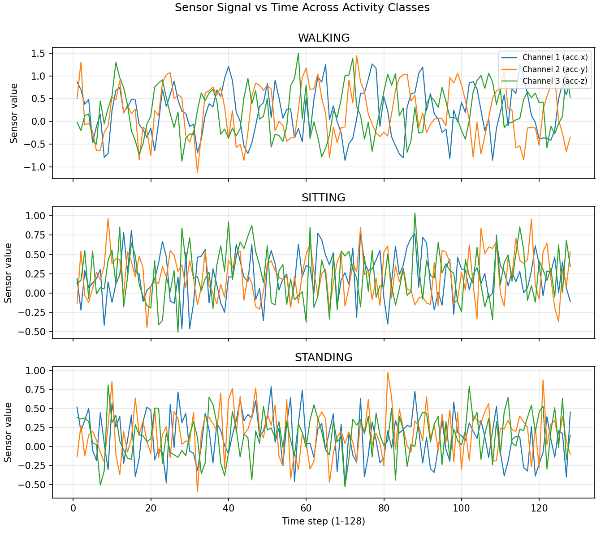
2. **SimpleRNN Training Curves & Confusion Matrix**:
   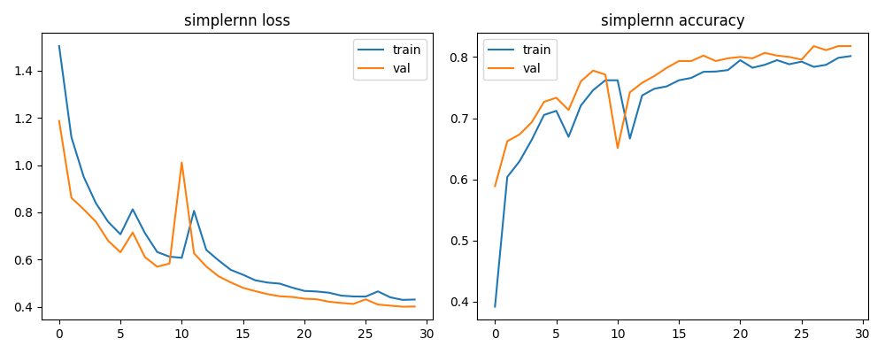
   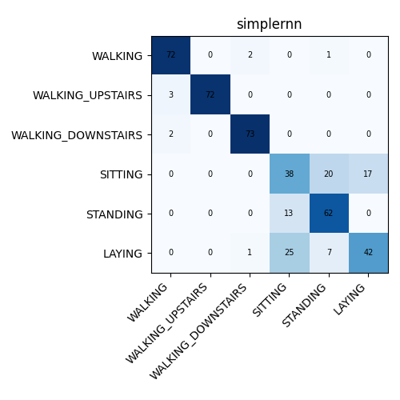
3. **LSTM Training Curves & Confusion Matrix**:
   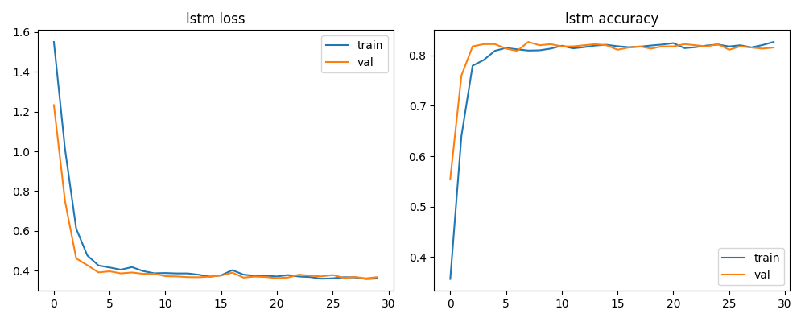
   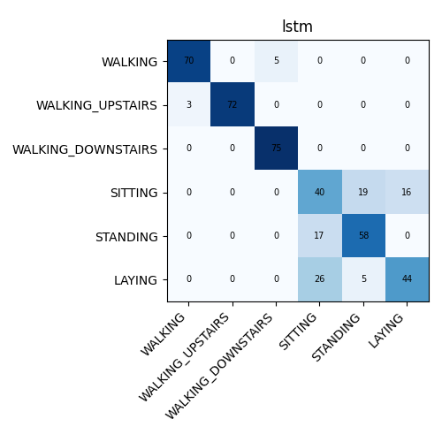
4. **GRU Training Curves & Confusion Matrix**:
   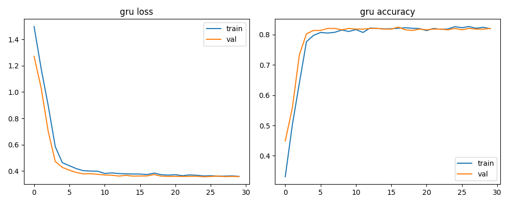
   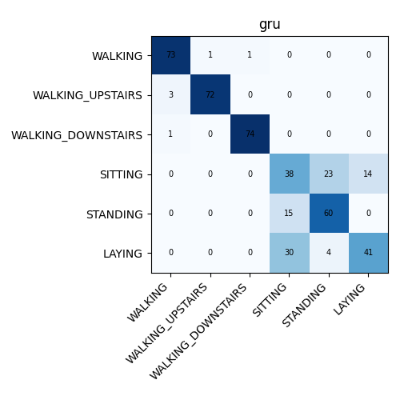
5. **Model Performance Comparison**:
   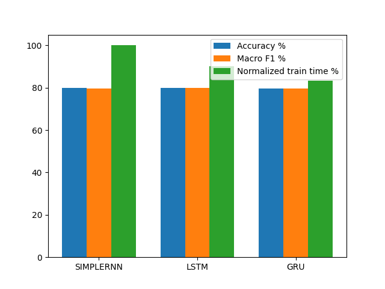
6. **Sequence Length Study**:
   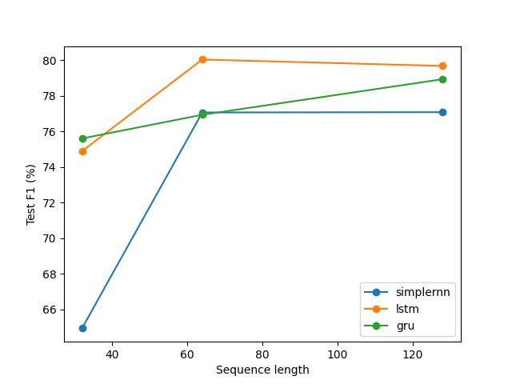
   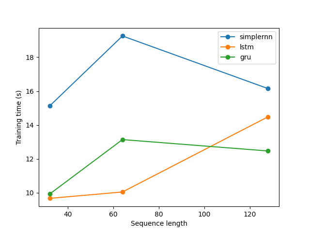
7. **Video Understanding**:
   
   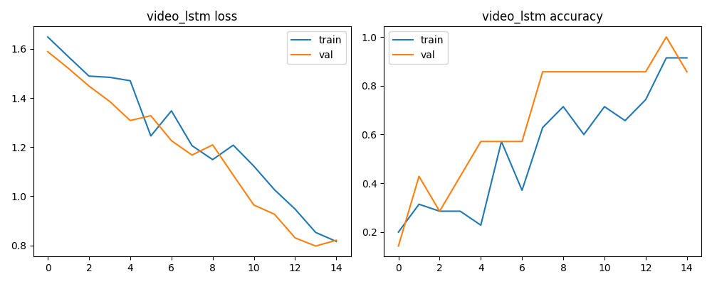
   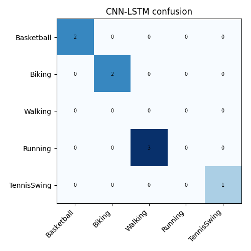
   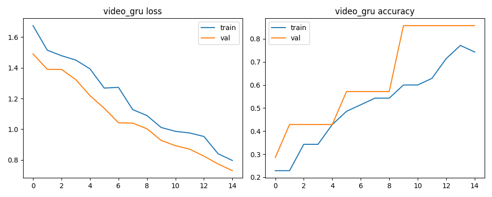
   

---

## 6. Directory Structure

```text
Ex6/
├── ex6.ipynb                  # Complete Jupyter notebook containing all implementations
├── README.md                  # Comprehensive documentation and experimental analysis
└── plots/                     # Visualizations, training curves, and confusion matrices
    ├── temporal_signals.png
    ├── simplernn_curves.png
    ├── simplernn_cm.png
    ├── lstm_curves.png
    ├── lstm_cm.png
    ├── gru_curves.png
    ├── gru_cm.png
    ├── model_comparison.png
    ├── seqlen_f1.png
    ├── seqlen_training_time.png
    ├── video_sample_frames.png
    ├── video_lstm_curves.png
    ├── video_lstm_cm.png
    ├── video_gru_curves.png
    └── video_gru_cm.png
```

---

## 7. Execution Instructions

### Running Locally
```bash
# Clone repository
git clone https://github.com/neha-tp/Deep_Learning_Lab.git
cd Deep_Learning_Lab/Ex6

# Install dependencies
pip install tensorflow numpy pandas matplotlib scikit-learn

# Launch notebook
jupyter notebook ex6.ipynb
```

### Running in Google Colab
1. Open [Google Colab](https://colab.research.google.com).
2. Upload `ex6.ipynb`.
3. Select GPU runtime (`Runtime -> Change runtime type -> T4 GPU`).
4. Run all cells (`Ctrl+F9`).
